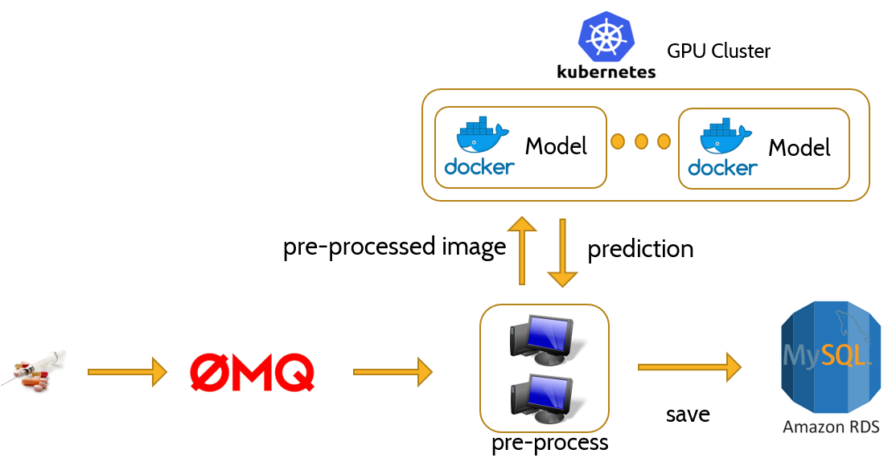

# Image Classfication with a data pipeline

Social media platforms is bringing us closer than ever. However it can be used for unintended purpose - selling illegal drugs (see this [Washington Post article](https://www.washingtonpost.com/business/economy/instagram-has-a-drug-problem-its-algorithms-make-it-worse/2018/09/25/c45bf730-bdbf-11e8-b7d2-0773aa1e33da_story.html?utm_term=.3700f22caf22)). In this project, I trained an image classification model to identify certain drug images, deployed it in a TensorFlow docker container, and scaled it up on a Kubernetes GPU cluster on AWS. 

### Prepare an image classification model
The model is trained with Keras (TensorFlow backend) using transfer learning with Resnet50 algorithm. Essentially the last layer of Resnet50 was replaced by a binary softmax, and the corresponding weights are re-trained for drug image classification.

The model was then exported to protobuff format and integrated into the official TensorFlow serving container, which exposes a REST API for inference. See the [official guide](https://www.tensorflow.org/serving/docker) for how to customize the official TensorFlow serving container to serve your own model.

### Deploy the model with Kubernetes on AWS
Kubernetes(k8s) is a portable, extensible open-source platform for managing containerized workloads and services. There are several ways to use k8s on AWS. A popular method is to use kops to spin up a k8s cluster. Find [this tutorial](https://ramhiser.com/post/2018-05-20-setting-up-a-kubernetes-cluster-on-aws-in-5-minutes/) for instructions.

After the k8s cluster is up and running, "deployment" and "service" could be initialized using their corresponding yml files. A "deployment" specifies the container(s) and its number of replicas to be deployed, while the "service" exposes the deployment with a load balancer which is accessible from outside of the 8ks cluster.

### Complete project framework
ZeroMQ(zmq) is used to generate a stream of images from an S3 bucket. Multiple CPU instances consume these images, send them to the k8s cluster for inference, and save the prediction to a MySQL database. See the diagram illustration below.

